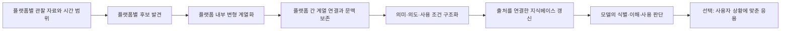

# 변화하는 멀티모달 밈을 활용한 콘텐츠 제작: RAG와 파인튜닝 비교

## 현재 우선 지침 — 2026-09-15 사용자 목표 변경

최신 사용자 지시가 아래 보존된 이전 계획보다 우선한다. 당장은 밈을 수집했다고 가정하고 **그 자료를 모델에 적용해 콘텐츠를 제작하는 두 방식**을 각각 실행·비교한다. 텍스트·이미지·음성·영상을 입력 범위에 포함하며 모델은 아직 미정이다. 밈 식별·이해는 제작을 지원하는 중간 과정이다. 모든 밈을 고정된 빈칸 치환형이나 텍스트 설명으로 바꾸어 연구 범위를 축소하지 않는다.

현재 비교 설계는 문맥/RAG와 실제 파라미터 미세조정이다. 같은 기반 모델, 같은 시점까지 이용 가능한 적응 자료와 제작 예시, 공통 제작 요청으로 비교하고 외부 기억을 추가하지 않은 기준선을 둔다. 문맥을 제공한 것을 가중치 학습이라고 쓰지 않는다. 새로운 밈 반영, 의미·사용 맥락 변화, 이전 용법 유지, 완성물의 품질, 구축·갱신·제작 비용을 함께 평가한다.

활성 목표는 **논문을 작성할 수 있을 수준까지 실제 실험하고, 실패도 로그에 남겨 중복 실험을 방지하는 것**이다. 문서 작성, 데이터 검사, 단위 테스트, 메모리 사전 점검만으로 목표를 완료 처리하지 않는다. 대본이나 제작 계획만 있다면 영상·이미지 완성물을 생성했다고 쓰지 않는다.

현재 기준 자료:

- [비교 실험 프로토콜](docs/multimodal_creation_protocol_v01.md)과 [설정 초안](configs/multimodal_creation_study_v01.json): 미정값은 `null`로 유지한다.
- [모델별 입출력·학습·자원 검토](docs/multimodal_model_feasibility_v01.md): 실제 읽은 공식 문서 범위와 한계를 표시한다.
- [관련 원문 검토](docs/multimodal_creation_literature_v01.md): 사실 지식 갱신·멀티모달 응답·밈 편집 연구를 현재 제작 과제와 구별한다.

사용자는 최종 제작물 범위를 **영상·이미지·글**로 확정했다. 입력은 텍스트·이미지·음성·영상 네 가지를 유지한다. 개별 제작 요청마다 결과 형식을 정하고, 형식별 성공률·품질·비용을 구분한다. 영상 길이·해상도, 이미지 규격, 글의 길이·용도 등 세부 조건과 제작 모델은 아직 미정이다. 독립적인 음성 완성물 제작은 추가 확정된 범위가 아니며, 입력 음성과 영상에 필요한 음향은 계속 고려한다.

자료 준비 여부에는 **“자료 준비 필요”**, GPU·서버·클라우드와 연산 비용 상한에는 **“미정”**이라는 답을 받았다. 자료 경로를 다시 요구하기보다 기존 자료의 재사용 가능성과 출처·사용 범위가 확인되는 자료 확보 경로부터 검토한다. 미정 예산을 0원 예산이나 무제한 지출 허용으로 해석하지 않는다. 모델·평가자·기간·표본 규모·투고처도 미정이다. 유료 연산과 사람 평가 모집은 확정된 범위를 따른다. 특정 학술지의 게재를 보장하거나 제안 표본 수를 KCI 공식 조건처럼 쓰지 않는다. 이번 답변 반영 기록은 [범위 확인 기록](data/research/multimodal_creation_user_scope_v04.json)에 남긴다.

### 데이터와 실행 기록의 원칙

- 실제 수집 자료, 연구자 작성 예시, AI 합성 자료, 자동 구조화와 사람 검수 버전을 구별한다. 사람 작업 시간을 기록한다.
- 시점 T에는 그때 이용 가능했던 원자료·파생 표현·연결·지식·제작 예시만 적응 입력으로 사용한다. 미래 해설과 평가 정답·결과를 넣지 않는다.
- 원본·재게시·프레임·음원·자막 등 파생 관계를 보존해 분할 누수를 막는다. 단순 플랫폼 반응 수를 합산하지 않는다.
- CR과 CF에 같은 적응 자료 풀을 허용한다. CF용 제작 목표를 추가했다면 CR에서도 검색할 수 있어야 한다. 평가용 목표는 양쪽 모두에서 제외한다.
- native 미디어 접근과 OCR·ASR·프레임 등 대리 표현을 구별한다. 제목·설명 수집만으로 영상·음성 데이터가 준비됐다고 주장하지 않는다.
- 모델 실험 전 `src/research_log.py`로 자료·코드·프롬프트·설정·모델 버전과 조건을 등록한다. 출력 경로·현재 시각·임의 식별자로 같은 실험의 중복 방지를 우회하지 않는다.
- 같은 명세를 다시 실행하려면 기존 실패를 읽고 `retry_of`와 구체적인 `retry_reason`을 기록한다. 기존 결과·실패·원자료는 보존한다.

현재 [실제 개발 실험 결과](data/derived/creation_experiments_20260915_v01/index.html)가 있다. Qwen2.5-0.5B의 텍스트 적용(T0: 38스텝·18출력), SmolVLM-256M의 실제 이미지·선택 프레임 입력(12스텝·9출력), T0의 실제 어댑터에서 나중 자료를 추가한 갱신(T1: 26스텝·15출력)을 수행했다. 본 개발실험 합계는 76스텝·42출력이다. 조건별 베이스 동일성·어댑터 변경과 T0 최종→T1 초기 텐서 동일성을 확인했다. T1의 옵티마이저 상태는 새로 시작했으며, 현실의 유행 변화 장기 관찰 결과가 아니다.

42출력은 호출 완료 수이며 11개는 출력 상한에 도달했다. 제작기는 글·이미지·3초 카드 영상을 실제 생성했고, 새 음원 계열 6개 영상에는 같은 허용 음원의 3초 구간을 붙였다. 이미지·영상 생성기 자체의 학습 효과로 주장하지 않는다. 독립 사람 평가 0명, 의미·창작 품질 우수성 검증 미완료, 음향 직접 입력 모델 미실행이다. 외부 MemeInterpret 인간 주석은 평가 참고 전용으로 확보했지만 현재 작품의 독립 평가를 수행한 것은 아니다. [정확한 집계](data/research/creation_execution_results_20260915_v01/summary.json)를 따른다. 기존 YouTube 발견 기록과 기능 검사·실패를 이번 제작 성능 점수로 재분류하지 않는다.

---

## 보존된 이전 계획: 플랫폼별 밈 발견과 이해

아래 내용은 목표 변경 전 기록이다. 현재 지침과 충돌하는 “발견을 주 연구로, 생성은 후속 선택 실험으로 둔다” 등의 문장은 현재 작업에 적용하지 않는다. 변경 전 파일 자체도 [보존 사본](docs/history/before_multimodal_creation_20260915_v01/RESEARCH_HANDOFF.md)에 남겼다.

KCI 등재 학술지 투고를 위한 연구계획 및 에이전트 인수인계서 · 2026-09-15 개정

이 문서가 현재 연구 방향의 기준이다. 2026-09-11에 작성한 생성 중심 계획을 대체한다. 실제 수집·모델 실행·평가를 완료했다는 뜻은 아니며, 아래 방법과 표본 규모는 검증할 제안이다.

## 1. 연구자의 의도와 목표

연구자는 밈을 찾는 것 자체가 어렵다는 문제에서 출발한다. ‘거제 야호’, ‘감옥에서 누가 돌아왔게’처럼 형태가 다른 밈을 발견하고, 실제 용례와 맥락을 모아, 모델이 해당 표현을 알아보고 의미와 사용법을 이해하게 하는 과정을 하나의 파이프라인으로 만들고자 한다. 장기적으로 사용자가 자기 상황에 맞게 응용하도록 지원한다.

확정 사항: 한국어 밈, 각 플랫폼에서의 발견, 발견과 모델 인식·이해의 연결, KCI 등재 학술지 투고 목표. 연구자는 자료원 질문에 ‘각 플랫폼마다’라고 답했다.

현재 제안: 플랫폼별 발견·용례 수집과 플랫폼 간 계열 연결·근거 기반 이해를 주 연구로 삼고, 응용문 생성은 활용 실험으로 둔다. 발견과 이해를 한 논문 안에서 함께 평가한다.

미정 사항: 구체적인 플랫폼 목록, 각 데이터 접근 방식, 관찰 기간, 연구 일정, 평가자, 모델·예산, 투고처. 모든 플랫폼에 동일한 접근이 가능하다고 전제하지 않는다. 단일 플랫폼만 연구하겠다고 사용자 의도를 축소하지 않는다.

## 2. 제목, 목적, 연구 질문

국문 가제: **다중 플랫폼 한국어 밈의 발견과 맥락 기반 이해를 위한 통합 파이프라인**

영문 가제: **A Multi-Platform Pipeline for Discovering and Contextualizing Korean Memes for Language Models**

연구 목적 서술 초안:

> 본 연구는 플랫폼별 온라인 자료에서 한국어 밈 후보를 발견하고, 플랫폼 내부 및 플랫폼 간 표현의 변형 관계와 실제 사용 맥락을 구조화하여 언어 모델의 밈 인식 및 이해를 지원하는 통합 파이프라인을 제안한다. 밈 발견, 계열 연결, 의미·의도 추출 및 근거 제공을 연결하고, 플랫폼별 정확도와 최종 이해 성능을 함께 평가한다. 특히 사전에 이름을 지정하지 않은 밈의 발견 가능성과 수집 과정의 누락·오류가 모델 이해에 미치는 영향을 분석한다.

이 문장은 계획이다. 성능 향상, 조기 발견, 새로운 밈에 대한 일반화는 실험 전에 확정하지 않는다.

- **RQ1 발견:** 이름을 미리 지정하지 않은 표현 중 밈 후보와 변형 계열을 어느 정도 발견할 수 있는가? 단순 빈도·급증 탐지와 비교해 어떤 사례를 추가로 찾는가?
- **RQ2 이해:** 발견 과정에서 얻은 용례를 구조화해 제공하면, 원시 용례만 제공할 때보다 새 사용 예의 계열 인식·의미·사용 의도 이해가 개선되는가?
- **RQ3 전체 과정:** 동일한 관찰 자료와 자원 조건에서 발견과 이해를 연결했을 때 전체 대상 중 몇 개를 찾아 올바르게 이해시키는가? 누락·가짜 후보·잘못된 계열화의 영향은 무엇인가?

핵심 기여 후보는 ‘관찰된 사용 패턴을 발견하고, 출처와 맥락이 연결된 지식으로 만들어, 모델 이해까지 검증하는 방법’이다. 여러 도구를 연결했다는 사실만으로 독창성을 주장하지 않는다.

## 3. 용어와 범위

**밈의 작업 정의:** 여러 독립적인 사용에서 인용·모방·변형되며, 공유되는 표현 관습이나 문맥적 기능을 갖는 언어적 표현. 인기도, 빈도, 새 단어 여부만으로 밈이라 판정하지 않는다. 구체적 포함 기준은 주석 파일럿에서 정한다.

발견 결과는 최소한 다음을 구분한다.

| 결과 유형 | 의미 |
|---|---|
| 새로 관찰된 밈 계열 | 관찰 시스템의 기존 목록에서 확인되지 않던 계열 |
| 기존 계열의 새 변형 | 단어·상황·말투가 달라진 같은 계열의 사용 |
| 기존 밈의 재유행 | 알려진 계열의 사용이 다시 증가 |
| 비밈·판단 보류 | 일반 문장, 상용구, 보도 인용, 광고 반복, 단순 신조어 또는 근거 부족 |

‘시스템에 새로 관찰됨’, ‘새로 유행함’, ‘세상에 처음 등장함’은 다르다. 초기 연구에서는 마지막 항목을 입증하려 하지 않는다.

‘모델이 인식한다’는 목표도 분리한다.

1. **식별:** 처음 평가하는 변형을 올바른 계열과 연결한다. 계열에 해당하지 않거나 근거가 없으면 이를 구분한다.
2. **이해:** 주어진 문맥에서 의미와 의도를 설명하고, 평범한 문자적 해석과 밈적 해석을 구별한다.
3. **사용 판단:** 새로운 상황에 적절한 표현인지 판단한다.
4. **응용:** 상황에 맞게 변형문을 만든다. 주 이해 평가 이후의 선택 실험이다.

각 플랫폼의 자료 형태와 접근 범위를 먼저 조사한다. 텍스트 게시물·댓글 또는 제목·자막·댓글을 공통 입력으로 사용하는 것은 초기 구현 제안이다. 영상·음성 플랫폼도 대상이 될 수 있으며, 실제 영상·음성을 읽지 않았다면 해당 플랫폼에서 관찰 가능한 텍스트만 분석했다고 명시한다. 음성·동작 없이는 판단하기 어려운 밈은 별도 표시한다. OCR·ASR의 필요성은 자료원별로 결정한다.

## 4. 하나의 파이프라인



### 4.1 관찰 자료 확보

플랫폼마다 밈 이름 검색에 의존하지 않는 고정 수집 범위를 정한다. 일정 기간의 게시물·댓글 흐름을 사전에 정한 규칙으로 표집하고, 게시 시점·수집 시점·출처·문맥을 보관한다. 밈 소개 계정이나 밈 이름 검색으로만 구성한 자료는 ‘밈을 처음 발견하는’ 평가 자료로 사용할 수 없다.

수집 어댑터는 플랫폼별로 분리하고, 공통 레코드로 정규화한다. YouTube·Instagram·TikTok·X·Threads·텍스트 커뮤니티 등은 접근성을 확인할 후보의 예시이며 확정 목록은 아니다.

| 공통 필드 | 역할 |
|---|---|
| platform, source_id, parent_id | 플랫폼·문서·대화 또는 영상과 댓글 관계 유지 |
| text, context, modality | 관찰된 문장과 주변 맥락, 텍스트·자막·음성전사 등의 구분 |
| posted_at, collected_at, available_at | 게시 시점과 실제 관찰 가능한 시점 구분 |
| engagement, sample_method | 플랫폼별 반응 수와 표집·추천 피드 사용 여부 기록 |
| original_or_repost, evidence_links | 재게시·복제 여부와 관련 근거 연결 |

조회수·좋아요·댓글 수를 플랫폼 간 같은 척도로 비교하지 않는다. 우선 플랫폼 내부의 평소 수준과 표집량에 비해 얼마나 증가했는지 본다. 실제 노출량이 없다면 관찰된 게시물 수 등 측정 가능한 분모를 사용하고 ‘관찰 표본 내 빈도’라고 표시한다. 추천 피드나 검색 순위에 의존한 표본은 전체 플랫폼을 대표한다고 하지 않는다. 접근하지 못한 플랫폼·필드는 결측으로 기록한다.

파일럿은 허용된 공개 자료의 제한된 스냅샷으로 시작해도 된다. 실제 접근 가능성을 검증하기 전 크롤러나 실시간 수집의 완성을 전제하지 않는다.

### 4.2 후보 발견

여러 신호를 조합하는 방안을 검토한다.

- 평소 대비 반복·증가하는 어구 또는 문장 구조.
- 같은 작성자의 도배가 아닌 독립적인 사용의 증가.
- 일부 단어가 바뀌어도 반복되는 구문·말투·질문 형식.
- 비슷한 맥락에서 인용·패러디되는 사례.

이를 구현하는 첫 후보는 표면적 어구 반복·시간별 변화와 문맥 임베딩을 결합하여 후보를 순위화하고, LLM이 관찰 용례를 근거로 판별하는 방식이다. 이것은 제안이며 이미 검증된 새 알고리즘이 아니다. 단순 빈도, 급증 탐지, 임베딩 군집, LLM 직접 판별과 비교하여 어떤 부분이 필요한지 확인한다.

LLM이 기억하는 유명 밈을 열거하게 하는 방법은 발견 기준선이나 별도 진단으로는 가능하지만, 자료에서 발견한 증거와 혼합하지 않는다. 결과마다 발견 근거 문서 ID를 요구한다.

### 4.3 용례 보강과 계열화

발견된 후보로 같은 관찰 자료 안에서 추가 용례를 검색한다. 외부 자료를 보강한다면 모든 비교 방법에 동일한 접근·시간·호출 예산을 주고 별도 조건으로 표시한다.

거의 같은 문구의 재게시와 독립적인 변형을 구별한다. 표면적으로 비슷하나 다른 밈을 합치는 오류, 표면적으로 달라도 같은 밈인 사례를 분리하는 오류를 기록한다. 계열 이름은 사람이 이미 알고 있는 정답 이름을 요구하지 않고 임시 ID로 생성할 수 있다.

플랫폼 내부 계열을 만든 뒤 플랫폼 간 같은 계열을 연결한다. 다른 플랫폼에 복사된 동일 영상·문장은 독립 창작·변형 수와 구분한다. 같은 표현이라도 플랫폼·커뮤니티에 따라 의미가 다르면 문맥별 하위 해석을 유지한다. 플랫폼 간 이동 방향이나 최초 발생지는 관찰 시점만으로 단정하지 않는다.

### 4.4 구조화와 지식베이스 갱신

계열별로 다음을 추출한다.

- 대표 표현과 실제 변형, 표현 형태와 매체 의존성.
- 의미·의사소통 의도와 적용 가능한 문맥.
- 보존해야 하는 특징, 변경 가능한 요소, 그대로 인용해야 하는 경우.
- 해석을 뒷받침하는 용례 ID와 서로 충돌하는 근거.
- 최초 관찰 시점, 최종 관찰 시점, 발견 신뢰도와 해석 신뢰도, 레코드 버전.

관찰되지 않은 뜻·기원·확산 이력을 모델이 만들지 않게 한다. 근거가 약한 항목은 보류하고, 이후 용례가 쌓이면 버전을 갱신한다. 사람 검수를 사용하면 검수 전후 성능과 소요 시간을 구분한다.

### 4.5 모델에 이해 근거 제공

초기 구현은 지식베이스를 검색해 실제 용례·해석 근거를 모델 입력에 제공하는 방식을 기본 제안으로 둔다. RAG나 문맥 제공으로 수행한 경우 갱신된 것은 지식베이스와 입력이며, 모델 가중치를 학습했다고 표현하지 않는다.

모델 가중치까지 갱신하는 미세조정은 필요한 효과와 예산이 확인된 뒤 별도 조건으로 추가한다. 사용자 목표인 ‘인식’은 먼저 실제 과제 성능으로 정의하고, 구현 수단과 동일시하지 않는다.

## 5. 평가 자료의 설계

### 5.1 발견 평가의 기준 집합

모든 비교 방법이 접근하는 플랫폼별 기간·문서 집합을 고정한다. 관리 가능한 소규모 자료에서는 독립 주석자가 전체 문서를 검토하여 밈 용례와 계열의 기준 자료를 만든다. 시스템이 찾은 후보만 주석하면 놓친 밈을 평가할 수 없다. 플랫폼 내부 계열과 플랫폼 간 연결의 정답은 구분해 작성한다.

자료가 크면 방법별 후보 합집합과 후보 밖 무작위 표본을 함께 검토한다. 이 경우 발견 가능한 전체 정답이 완전하지 않으므로 재현율의 범위를 한정하거나 추정 방식과 불확실성을 보고한다. ‘인터넷의 밈을 모두 찾았다’는 재현율을 주장하지 않는다.

일반적 반복 문구, 광고·복제 게시물, 문자 그대로 사용된 표현을 음성 사례로 포함한다. 밈 판정과 계열 관계는 최소 2명의 독립 주석 후 불일치를 검토한다.

### 5.2 시간 순서

- 개발 기간: 후보 신호·주석 지침·프롬프트·임계값 설계.
- 검증 기간: 설정 선택 및 예산 결정.
- 시험 기간: 고정된 방법으로 순서대로 관찰하고 발견·갱신을 실행.
- 각 평가 시점 T에서는 게시·수집·이용 가능 시점이 T 이하인 자료만 검색·구조화·모델 입력에 사용.

나중에 작성된 밈 설명 글이나 정답 응용문을 과거 시점의 지식베이스에 넣지 않는다. 다른 플랫폼에서 가져온 근거도 동일한 이용 가능 시점 제한을 적용한다. 과거 게시일만 있는 현재 검색 결과는 당시의 발견 가능성을 보장하지 않는다. 과거 시점을 정밀하게 복원할 수 없다면 그 한계를 명시하고, 제한된 스냅샷 평가나 앞으로 수집하는 자료로 검증한다.

후속 시점의 자료를 사람이 정답 확인에 활용하는 경우에도 평가용으로만 격리한다. 시험용 설명·주석·질문·모델 점수는 발견과 지식 추출 과정에 노출하지 않는다. 플랫폼 간 계열 연결에도 `linked_at`을 기록한다. 오래된 게시물 사이의 관계라도 나중에 발견한 연결이나 해석을 과거의 지식 버전에 소급하여 넣지 않는다.

### 5.3 계열과 질문 분리

개발에 사용한 계열과 시험 기간에 새로 관찰된 계열을 구분하고, 기존 계열의 새 변형·재유행도 별도로 보고한다. 사람이 알려 준 seed 계열이 있다면 seed 기반 확장과 독립 발견을 별도 결과로 표시한다.

이해 질문은 지식 구축에 쓴 용례와 별도로 작성한다. 같은 문장을 그대로 질문으로 복사하지 않는다. 계열 인식 질문에는 해당 계열의 이름을 정답 힌트로 주지 않고, 의미 설명 질문에는 문자적 해석과 구별해야 하는 문맥을 포함한다.

기반 LLM이 평가 대상 밈을 사전학습에서 보았는지는 보장할 수 없다. 지원 자료 없이 수행한 이해 점수를 먼저 측정하고, 기존에 잘 알던 항목과 지원 후 개선된 항목을 나누어 분석한다.

## 6. 실험 구성

### 6.1 발견과 이해의 효과를 분해하면서 통합 평가

| 축 | 기준선 | 제안 조건 |
|---|---|---|
| 발견 D | D0: 단순 어구 빈도·증가 기반 발견 | D1: 변형 구조·독립 사용·문맥을 고려한 발견 |
| 이해 U | U0: 발견된 원시 용례·문맥 제공 | U1: 동일 용례·문맥 + 자동 구조화 정보 제공 |

기본 통합 비교는 D0U0, D1U0, D0U1, D1U1이다. 같은 입력 문서·후보 검토 예산·기반 LLM을 사용한다. 서로 다른 비용이 발생하면 이를 기록하고 예산을 맞춘 비교 또는 성능-비용 관계를 제시한다.

- D1U0−D0U0: 발견 방법을 바꾼 영향.
- D0U1−D0U0 및 D1U1−D1U0: 각 발견 결과에 구조화 정보를 추가한 영향.
- D1U1−D0U0: 전체 방법의 영향.

구조화 효과를 자세히 분석할 때는 대상 계열과 원시 근거를 고정한다. 동일 자동 추출 정보를 서술형과 필드형으로 제공하는 비교를 추가할 수 있다. 원자료에 정보를 추가한 효과를 JSON 형식만의 효과로 해석하지 않는다.

별도 참고 조건: 아무 지원도 없는 기반 모델, 사람이 확인한 계열·용례를 제공하는 조건. 사람 자료로 성능이 좋아지는 결과는 실제 자동 발견의 성과와 구분한다.

기존 생성 계획의 B1/B2/B3는 필요한 경우 이 고정 근거 진단에 활용할 수 있다. 현재 주실험의 중심은 D와 U를 연결한 전체 과정이다.

### 6.2 단계별 지표

| 단계 | 평가 대상 | 지표 예시 |
|---|---|---|
| 후보 발견 | 실제 밈 후보와 누락 | Precision@K, 정해진 기준 집합 내 계열 재현율, 새 계열 수 |
| 발견 시간 | 관찰 가능한 첫 근거 대비 발견 시점 | 발견 지연과 관찰 범위. 최초 창작 시점과 구분 |
| 계열화 | 같은 밈의 변형 관계 | B-cubed F1 또는 쌍별 F1, 잘못 합치거나 나눈 비율 |
| 구조화 | 의미·의도·사용 조건의 근거 충실성 | 사람 평가, 근거 없는 해석·잘못된 원형 연결 비율 |
| 식별·이해 | 새 변형 식별, 문맥상 의미·의도, 사용 판단 | 계열 정확도/F1, 블라인드 사람 평가, 사용 판단 정확도 |
| 운영 부담 | 사람 검수와 모델 호출 | 참양성 계열당 검수 시간, 호출·토큰·지연, 보류율 |

실제 평가 자료와 목적에 맞는 소수의 주요 지표를 선택하고 시험 실행 전에 고정한다. 지표 목록을 모두 필수로 취급하지 않는다.

플랫폼별 결과와 플랫폼 간 연결 정확도를 각각 보고한다. 통합 점수는 플랫폼을 동일 가중하는 평균과 실제 표본 비중을 반영하는 집계를 구분한다. 플랫폼 내부만 이용한 조건과 여러 플랫폼의 근거를 결합한 조건을 보조 비교하여 결합의 이점·오류를 확인한다. 새로운 플랫폼으로의 일반화를 주장하려면 별도의 플랫폼 보류 평가가 필요하다.

### 6.3 전체 과정의 성공과 누락

전체 과정의 핵심은 **기준 집합에 있는 밈을 올바르게 발견·연결하고, 그 밈의 별도 질문에 올바르게 답했는가**다. 계열마다 질문 수가 다르면 계열 안에서 평균을 내고 계열별 동일 가중치를 주는 방안을 고려한다.

‘발견하고 이해한 비율’의 분모는 발견된 계열만이 아니라 평가 대상 전체 계열이다. 미발견 계열은 이 결합 지표에서 성공으로 세지 않는다. 동시에 모델이 내부 지식으로 답할 수도 있으므로, 검색 성공 여부와 무관한 전체 질문 이해 점수도 따로 보고한다. 두 지표를 혼동하지 않는다.

가짜 후보는 정답 계열 분모에 포함되지 않으므로 별도의 정밀도·검수 부담 지표가 필요하다. 발견에 성공한 항목만의 이해 결과도 진단용으로 보고하되 전체 성능처럼 제시하지 않는다.

오류를 ‘발견 누락→잘못된 계열화→잘못된 설명→모델 답변 오류’로 추적한다. 단계별 점수가 좋아도 전체 점수가 개선되지 않는 경우를 분석한다.

## 7. 사람 평가와 분석

한국어 평가자 2~3명이 방법명을 모른 상태에서 독립 평가한다. 밈 친숙도를 기록하고, 의미·의도 평가용 원자료는 모든 조건에 동일하게 제공한다. 자동으로 만든 지식 레코드를 사람 평가의 정답으로 삼지 않는다.

정답 자료 작성자와 최종 출력 평가자는 가능한 한 분리한다. 범주형·순서형 척도에 맞는 평가자 일치도를 보고하고 애매한 사례를 삭제하여 일치도를 부풀리지 않는다.

주요 비교, 주지표, 표본 수, 다중 비교 처리 방식을 본실험 전에 정한다. 같은 계열의 변형·같은 시간 구간의 관찰이 독립적이지 않음을 고려한다. 계열·시간 구간의 의존성에 맞는 재표집이나 혼합효과 분석을 선택하고, 효과 크기와 신뢰구간을 제시한다.

LLM 자체 채점만으로 성공을 판정하지 않는다. 사람 평가가 필요한 항목과 자동 평가가 가능한 항목을 나누고, 사용한 모델·프롬프트·버전·실행 시점·실패·비용을 남긴다.

## 8. 파일럿과 실행 순서

**처음 목표는 이미 아는 밈 목록 100개를 채우는 것이 아니라, 정해진 관찰 자료에서 무엇을 발견하고 어떻게 이해 근거로 바꾸는지 확인하는 것이다.**

1. 플랫폼별 접근 가능 범위·필드·기간·비용을 조사하고 실제 구현할 목록을 연구자와 정한다. 다중 플랫폼 목표를 유지하면서 수집 어댑터를 순차 구현할 수 있다.
2. 각 플랫폼에서 사람이 전수 검토할 수 있는 작은 문서 스냅샷을 만든다. 규모는 문서 길이와 평가자 시간에 맞춰 정하며, 수천 건은 검토할 후보 범위의 예시일 뿐 필수 조건이 아니다. 처음부터 전 플랫폼의 대규모 상시 수집을 완성할 필요는 없다.
3. 주석 지침과 출처·시간 기록을 만들고, 시스템과 독립적으로 정답 계열·비밈 사례를 검토한다.
4. D0과 D1 후보를 비교한다. 이미 알려 준 seed의 확장인지 사전 이름 없이 발견한 것인지 표시한다.
5. 자동 계열·의미 레코드를 만들고 근거 충실성을 점검한다.
6. 발견 결과를 그대로 이용해 D×U 조건을 비교하고, 누락을 포함한 전체 평가가 가능한지 확인한다.
7. 발견할 만한 사례가 너무 적거나 애매하면 자료원·기간·작업 정의를 개발 단계에서 조정한다. 성공 사례를 만들기 위해 정답 목록을 수집 입력에 넣지 않는다.
8. 파일럿의 검수 부담·오류·효과 변동성을 바탕으로 본실험 기간과 표본을 확정한다.

계속 진행할 근거: 일반적인 반복과 밈을 어느 정도 구분할 수 있고, 여러 형태의 새 계열·변형을 확보하며, 지원 자료가 독립 질문의 이해에 실제로 도움을 주는지 검증할 수 있음.

재검토할 신호: 알려 준 이름 검색에만 의존, 시스템 후보 외 정답을 만들 수 없음, 모델의 추측이 용례보다 설명을 지배함, 대부분 텍스트만으로는 평가 불가능함. 이런 경우 자료원·범위·방법을 조정하고 주장을 제한한다.

## 9. 필요한 데이터와 코드 산출물

```text
docs/             연구계획, 관련연구, 밈 판정·계열화·이해 평가 지침
data/observations 게시·수집·이용가능 시점, 출처, 텍스트와 문맥
data/annotations  독립 사람 정답, 비밈·보류 판정, 근거, 버전
data/evaluation   격리된 질문·정답·분할·평가 시점
src/discovery     후보 생성, 순위화, 시간별 신호
src/grouping      중복 처리, 변형 연결, 계열 ID
src/knowledge     근거 기반 구조 추출, 보류, 버전 갱신
src/understanding 검색·문맥 제공, 식별·이해·사용 판단
configs/          자료원·기간·모델·예산·설정
prompts/          추출·판별·설명 프롬프트
results/          발견 로그, 근거 스냅샷, 원출력, 사람 평가, 분석
paper/            논문 초안과 재현 가능한 표·그림
```

권장 계열 레코드 필드: `family_id`, `platform_family_ids`, `representative_text`, `variants`, `platforms`, `observed_since_by_platform`, `available_at`, `source_ids`, `form`, `meaning`, `intent`, `usage_conditions`, `preservation_rules`, `editable_parts`, `evidence_ids`, `discovery_confidence`, `interpretation_confidence`, `review_status`, `version`.

출처가 없는 설명은 별도로 표시하고, 실제 수집·사람 작성·AI 합성을 구분한다. 시점별 지식베이스를 복원할 수 있도록 버전을 보관한다. 위 디렉터리는 구현 제안이며 현재 생성되었다는 뜻이 아니다.

## 10. 선행연구와 기여의 경계

| 자료 | 참고할 내용 | 확대 해석하지 않을 부분 |
|---|---|---|
| [Catchphrase, ACL-IJCNLP 2021](https://aclanthology.org/2021.acl-short.1/) | 변형된 문화적 인용·snowclone을 탐지하는 과제 | 모든 새 밈을 이름 없이 발견하는 완성 시스템으로 보지 않는다. |
| [SLANG, EMNLP 2024](https://aclanthology.org/2024.emnlp-main.698/) | 새 인터넷 표현을 문맥을 통해 이해하는 평가와 FOCUS 방법 | 본 파이프라인의 수집·계열화 전체를 검증한 것으로 인용하지 않는다. |
| [Social Meme-ing, NAACL 2024](https://aclanthology.org/2024.naacl-long.166/) | 밈의 템플릿·의미 기능 군집과 커뮤니티 분석 | 온라인 새 밈 발견부터 모델 갱신까지 해결했다고 하지 않는다. |
| [A Template Is All You Meme, NAACL 2025](https://aclanthology.org/2025.naacl-long.525/) | 템플릿 지식베이스와 템플릿별 평가 분리 | 자료를 구조화했다는 사실만으로 새로운 기여라고 하지 않는다. |
| [MemeReaCon, EMNLP 2025](https://aclanthology.org/2025.emnlp-main.176/) | 게시 맥락에 따른 밈 의미·의도 평가 | 계열 이름 식별을 깊은 맥락 이해와 동일시하지 않는다. |

후속 검토에는 밈·유행어·신조어 자동 발견, emerging concept acquisition, 문화적 인용 탐지, 시간적 지식 갱신을 포함한다. 혐오 밈 분류와 새 밈 발견은 다른 과제이므로 검색 결과를 구분한다. 논문 본문을 읽고 기존 방법과 직접 겹치는 부분을 대조한 뒤 기여를 확정한다.

이 프로젝트가 KCI 논문으로 평가받을 가능성은 자료의 필요성, 방법의 차이, 실험의 신뢰성에 달려 있다. ‘한 파이프라인으로 합쳤다’거나 ‘한국어라서’라는 이유만으로 게재 가능성을 단정하지 않는다. 특정 학술지는 미정이며, 후보의 현재 등재 상태와 규정은 [KCI 공식 학술지 검색](https://kci.go.kr/kciportal/landing/journalList.kci) 및 학술지 공식 사이트에서 확인한다.

## 11. 논문 구성 초안

1. 서론: 밈 발견의 어려움과 모델 이해 갱신 필요성, 연구 질문.
2. 관련연구: 발견·변형 탐지, 밈 구조·문맥 이해, 지식 갱신.
3. 과제·데이터: 관찰 범위, 시간, 밈 정의, 계열과 정답 구축.
4. 제안 방법: 발견→용례 보강→계열화→근거 구조화→모델 이해.
5. 실험: 발견 기준선, D×U 비교, 시간 제한, 단계·전체 지표.
6. 결과·논의: 발견 누락과 오탐, 오류 전파, 이해 향상, 비용·한계.
7. 결론: 실제 확인한 결과와 응용 생성·추가 매체 등 후속 과제.

## 12. 다음 에이전트의 첫 작업

이 문서를 먼저 읽고 기존 저장소를 확인한다. 자료원 결정과 접근성 확인을 가장 먼저 진행한다. 확인되지 않은 수집 권한·비용을 가정하지 않으며, 공개 문헌 검토와 로컬 설계 작업은 진행할 수 있다.

첫 산출물은 (1) 접근 가능한 자료원 후보와 제약, (2) 관찰·발견·이해의 입출력 명세, (3) 독립적인 정답 구축·시간 분할 방법, (4) D0/D1과 U0/U1 파일럿 실행안이다.

생성 모델 비교만으로 연구 범위를 다시 좁히지 않는다. 사용자의 목표는 발견과 이해를 연결하는 과정이다. 응용 생성은 이 과정의 활용 가능성을 보여주는 후속 단계로 유지한다.
